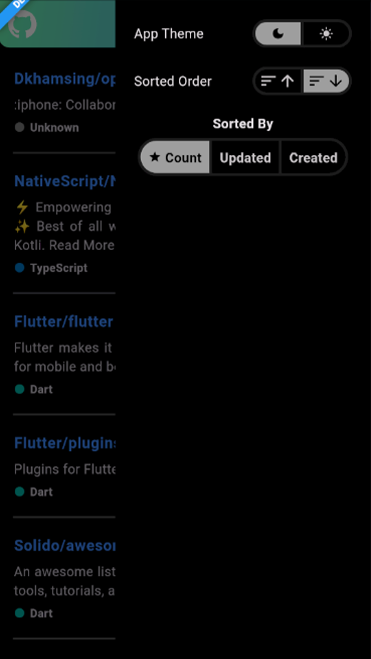

# BS23_Flutter_Task
Discover most starred Flutter repos! Scalable Flutter app w/ modular architecture, state management &amp; clean code principles. Leverages GitHub API &amp; displays name, description &amp; star count.

## Project Structure
- lib
    - app
        -main_dev.dart
        -main_qa.dart
        -main_prod.dart
    - core
        - constants
            - api_constants.dart
            - color_constants.dart
            - db_constants.dart
            - list_constants.dart
            - string_constants.dart
        - utils
            - dependency_injection.dart
    - data
        - enums
            - git_repo
                - enums of git_repo
        - models
            - git_repo
                - git_repo.dart
                - git_user.dart
                - others
        - repositories
            - git_repo_repository.dart
            - git_user_repository.dart
    - global
        - controllers
            - shared_pref_controller.dart
        - widgets
            - helpers
            - others widgets
    - modules
        - git_repo
            - business_logic
                - git_repo_binding.dart
                - git_repo_controller.dart
            - local_widgets
            - screens
    - routes
        - app_pages.dart
        - app_routes.dart
    - services
        - database
        - providers

## Screenshots

Here are some screenshots of the project in action:

### Dark Mode

 
 
Git Repo List (Verstical Scrollable)

 
 
Git Repo Details with User Data at top

 
 
End Drawer with toggle options for App Theme, Sort Order and Sort Option

### Light Mode

 
 
Git Repo List (Verstical Scrollable)

 
 
Git Repo Details with User Data at top

 
 
End Drawer with toggle options for App Theme, Sort Order and Sort Option

