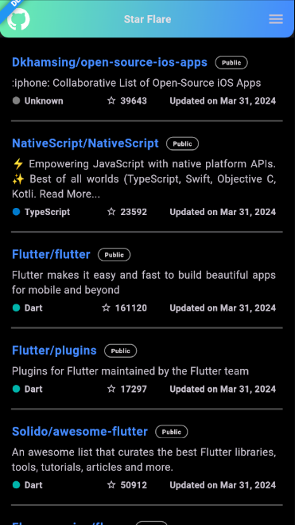

  
  <h1>StarFlare</h1>

# StarFlare
Discover most starred Flutter repos! Scalable Flutter app w/ modular architecture, state management &amp; clean code principles. Leverages GitHub API &amp; displays name, description &amp; star count.

## Project Details
In this project, I utilized various tools and methodologies to ensure efficiency and reliability:

1. **GetX as the Preferred State Manager**: Leveraged GetX for its simplicity and robustness in managing application state.

2. **Get_storage for Local Storage**: Utilized Get_storage as the preferred local storage solution, providing seamless access to persistent data akin to shared preferences.

3. **SQLite for Local Database**: Employed SQLite as the local database to store fetched data from APIs, effectively mitigating redundant API calls and enhancing overall performance.

4. **GetX Repository Pattern**: Implemented the GetX Repository pattern, ensuring a clear and effective abstraction layer between the API client and the application, facilitating better maintainability and scalability.

5. **Application Flavors**: Utilized 3 App Flavors—DEV, QA, and PROD—for distinct environments: 
   - *Development*: Facilitates rapid development and debugging.
   - *Quality Check*: Ensures thorough testing and validation before deployment.
   - *Production*: For the final release version, ensuring stability and reliability in a production environment.

These measures collectively contribute to the robustness, scalability, and maintainability of the project.

## Project Structure
- lib
    - app
        -main_dev.dart
        -main_qa.dart
        -main_prod.dart
    - core
        - constants
            - api_constants.dart
            - color_constants.dart
            - db_constants.dart
            - list_constants.dart
            - string_constants.dart
        - utils
            - dependency_injection.dart
    - data
        - enums
            - git_repo
                - enums of git_repo
        - models
            - git_repo
                - git_repo.dart
                - git_user.dart
                - others
        - repositories
            - git_repo_repository.dart
            - git_user_repository.dart
    - global
        - controllers
            - shared_pref_controller.dart
        - widgets
            - helpers
            - others widgets
    - modules
        - git_repo
            - business_logic
                - git_repo_binding.dart
                - git_repo_controller.dart
            - local_widgets
            - screens
    - routes
        - app_pages.dart
        - app_routes.dart
    - services
        - database
        - providers

## App Screenshots
Here are some screenshots of the Application in action:

### Dark Mode

Git Repo List (Verstical Scrollable)

Git Repo Details with User Data at top

End Drawer with toggle options for App Theme, Sort Order and Sort Option

### Light Mode

    

        
        
Git Repo List (Verstical Scrollable)

    

    

        
        
Git Repo Details with User Data at top

    

    

        
        
End Drawer with toggle options for App Theme, Sort Order and Sort Option

    

## Contributing
Contributions are welcome! Please fork the repository and submit a pull request.

## License
This project is licensed under the [MIT License](LICENSE).